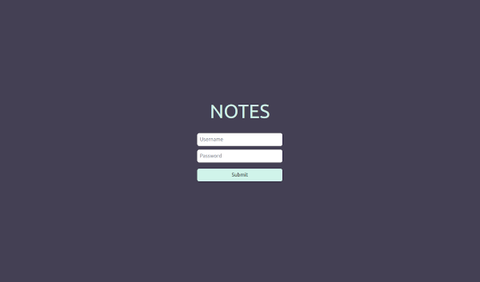
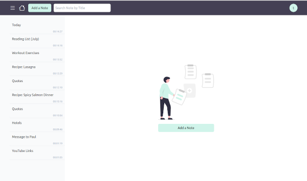

# Notes

Notes is a fullstack web application, built with Node.js/Express and React, for writing notes and sharing them with friends. The application has a RESTful API, multiple persistent storage options, cookie-based authentication and WebSocket connections.

## Features/Use Cases

- Jot down quick ideas or save longer notes and have them at your disposal
- Write to-do lists, shopping lists, paste excerpts from books and websites, etc.
- Work on a collaborative notebook with friends
- Enjoy a convenient and mobile-friendly UI
- Receive real-time updates about notes that have been added, edited or deleted by other users
- Authenticate securely into the application
- Search notes quickly by title
- Manage user data with a CLI
- Choose a data storage set-up that suits your preferences and needs
    - File system
    - LevelDB
    - SQLite
    - PostgreSQL
    - Sequelize --> for easy hook-up of DBs supported by Sequelize
- Keep your notes private on your own server
- Deploy easily and for free to Heroku

## Walk through Notes

**Log-In Screen**

Notes requires you to log in with a username and password. Users can be added, updated, deleted, and more with a CLI (see below).

**Home Screen**

The layout of Notes displays all of your notes in a toggeable side menu to the left and the main content to the right. On mobile screens the side menu can be displayed and hidden as an overlay.

 The navigation bar contains the following elements:

- Menu button: Performs said toggling of the side menu
- Home button: Go to Home Screen
- Add-a-Note button: Go to Edit Screen with an empty note template
- Search field: Type in a search term and find notes by their title
- User/Logout button: Open dropdown with user information and Logout

**Edit Screen**

The edit screen has a field for a note title and body. You can leave out either one of them, but you can't save an empty note. Finally, save your note by clicking `Submit` or cancel the action.

**View Screen**

## Architecture

The back-end of Notes is built with Node.js and Express. It can be set up with multiple data storage options that are selectable via environment variable upon runtime (see below). The supported databases are LevelDB, SQLite, PostgreSQL, plus the multi SQL dialects ORM Sequelize. Aside from that, data can also be persisted to the file system. Cookie-based authentication is realized with express-session and Passport.js.

The front-end is a React application, styled with TailwindCSS. Client-side routing is handled with React Router.

For a dynamic communication between server and client, WebSockets are implemented with Socket.IO.

## Development

## Deployment

The application is deployable with Heroku (free tier and up). See https://devcenter.heroku.com/ for instructions.

