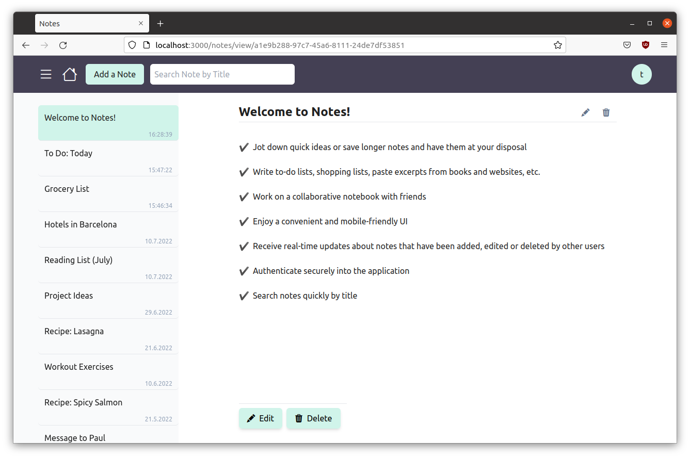
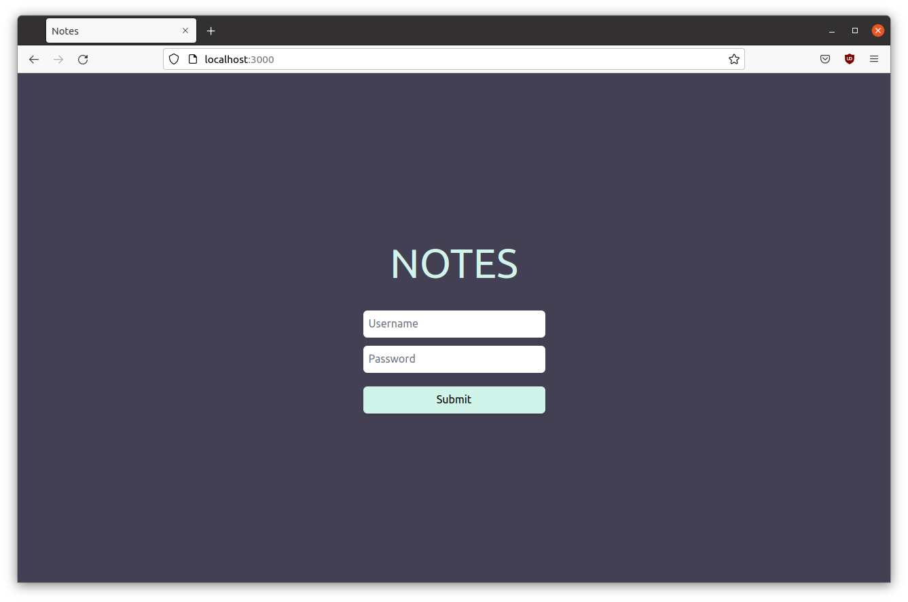
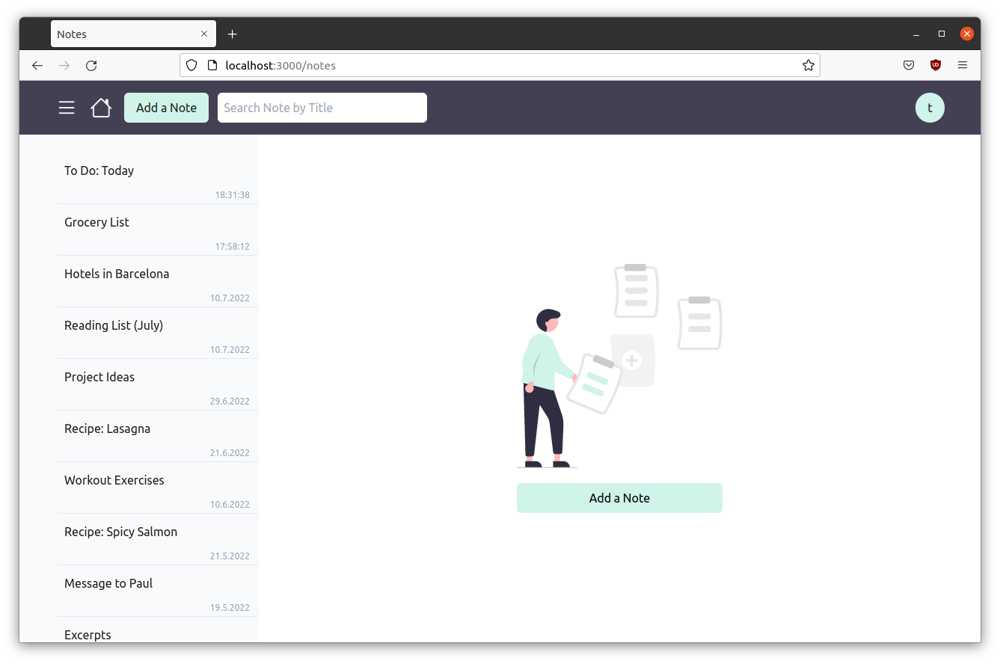
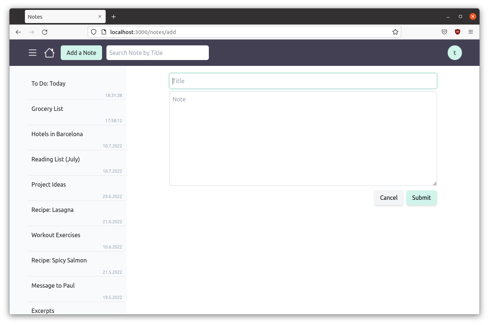
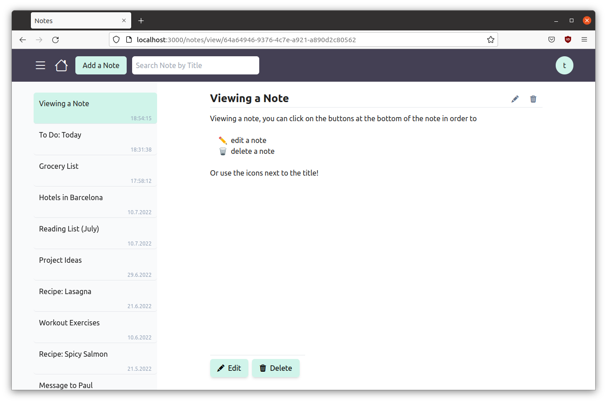

# Notes

Notes is a fullstack web application, built with Node.js/Express and React, for writing notes and sharing them with friends.

The application has a RESTful API, multiple persistent storage options, cookie-based authentication and WebSocket connections.



## Features/Use Cases

- Jot down quick ideas or save longer notes and have them at your disposal
- Write to-do lists, shopping lists, paste excerpts from books and websites, etc.
- Work on a collaborative notebook with friends
- Enjoy a convenient and mobile-friendly UI
- Receive real-time updates about notes that have been added, edited or deleted by other users
- Authenticate securely into the application
- Search notes quickly by title
- Manage user data with a CLI
- Choose a data storage set-up that suits your preferences and needs
    - File system
    - LevelDB
    - SQLite
    - PostgreSQL
    - Sequelize --> for easy hook-up of DBs supported by Sequelize
- Keep your notes private on your own server
- Deploy easily and for free to Heroku

## Walk through Notes

### Log-In Screen



Notes requires you to log in with a username and password. Users can be added, updated, deleted, and more with a CLI (see below).

### Home Screen



The layout of Notes displays all of your notes in a toggeable side menu to the left and the main content to the right. On mobile screens the side menu is not visible by default, but can be displayed as an overlay.

 The navigation bar contains the following elements:

- Menu button: Perform said toggling of the side menu
- Home button: Go to Home Screen
- Add-a-Note button: Go to Edit Screen with an empty note template
- Search field: Perform a note search by title on user input
- User/Logout button: Open dropdown with user information and Logout

### Edit Screen



Add a note by clicking the `Add a Note` button in the navigation bar or the one in the Home Screen. The edit screen has fields for a note title and a note body. You can leave out either one of them, but you can't save an empty note. Finally, save your note by clicking `Submit` or cancel the action.

### View Screen



View your notes by clicking on their titles displayed in the side menu. There are `Edit` and `Delete` buttons at the bottom of the note as well as icons next to the title. The `Edit` button/icon will direct you to the Edit Screen, where you can make changes to the note's title and body. The `Delete` button/icon will open a modal dialog that asks you to confirm the action.

:exclamation: Once you confirm the deletion, the deleted note won't be retrievable.

## Architecture

The back-end of Notes is built with Node.js and Express. It can be set up with multiple data storage options that are selectable via environment variable upon runtime (see below). The supported databases are LevelDB, SQLite, PostgreSQL, plus the multi SQL dialects ORM Sequelize. Aside from that, data can also be persisted to the file system. A dynamic `import()` handles the import of the module corresponding to the selected database from the `models` directory. Cookie-based authentication is realized with express-session and Passport.js.

The front-end is a React application, styled with TailwindCSS. Client-side routing is handled with React Router.

For a dynamic communication between server and client, WebSockets are implemented with Socket.IO.

## Development

### Requirements

- Node.js (tested on v16)
- optionally: PostgreSQL (or whatever Sequelize-supported database you decide to hook up that requires an installation)

### Starting the App

- Copy the content of `.env.example` into a new `.env`
- Insert a session secret at `SESSION_SECRET`
- Note: all of the other empty environment variables are *optional* and/or *dependent on the data storage option* you are choosing (see [Configuring Data Storages](##Configuring-Data-Storages))
- Add a new user with which to log in: `node cli --store <fs|level|sqlite3|sequelize|postgres> add <username> --password <password>`
- Run one of the following commands depending on data storage option (for PostgreSQL, make sure you have PostgreSQL installed and configured: see [PostgreSQL](###PostgreSQL))
    - | Data Storage | Command |
      | --- | --- |
      | File system | `npm run fs-start` |
      | LevelDB | `npm run level-start` |
      | SQLite3 | `npm run sqlite3-start` |
      | Sequelize | `npm run sequelize-start` |
      | PostgreSQL | `npm run postgres-start` |
- Go to `localhost:3000`

## Deployment

The application is deployable with Heroku (free tier and up). See https://devcenter.heroku.com/ for instructions.

## Configuring Data Storages

### Optional: File System

Using the file system as data storage, the application saves notes to `notes-fs-data` and users to `users-fs-data` by default. If you want to use a different location, you can do so by assigning the directory to your `.env` at `NOTES_FS_DIR` and `USERS_FS_DIR`, respectively.

### Optional: LevelDB

The default directory for LevelDB is `notes.level`. To change it, go to your `.env` and assign a directory to `LEVELDB_LOCATION`.

### Optional: SQLite3

Notes will create the SQLite3 database at `notes.sqlite3`, by default. You can choose another directory via the environment variable `SQLITE_FILE` in your `.env`.

### Sequelize

By default, Sequelize will connect with SQLite3. However, you can easily connect Sequelize with any of its supported databases. (You might need to install the database on your system, as for example MySQL). The following is an example of setting up Notes with MySQL:

- Install and configure MySQL on your system
- Create a database for the Notes app, e.g. called `notes_app`
- Change the content of `server/models/sequelize-connect.yaml` to something like this:
```
    dbname: notes_app
    params:
        host: localhost
        port: 3306
        dialect: mysql
```
- In `.env`, assign your MySQL username and password to `SEQUELIZE_DBUSER` and `SEQUELIZE_DBPASSWD`

### PostgreSQL

In order for Notes to connect with PostgreSQL, you need to 

- Install and configure PostgreSQL on your system
- Create a dabase for the Notes app, e.g. `notes_app`
- Configure the `.env` with your PostgreSQL username, password and database name at
    - `PG_USER`
    - `PG_PASSWD`
    - `PG_DATABASE`

## Users CLI

